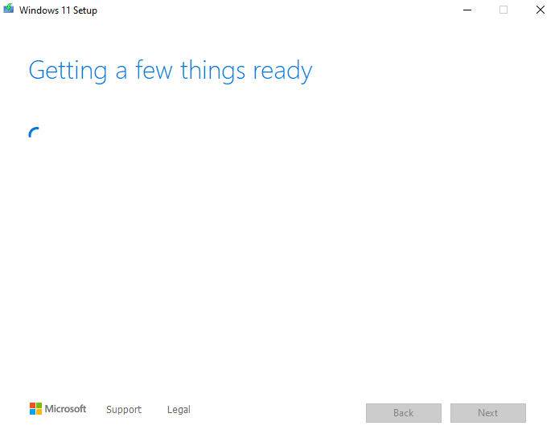
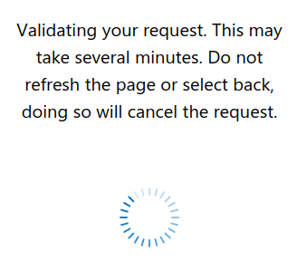

<div align="center">
    <a href="https://github.com/ElliotKillick/Mido">
        
    </a>
</div>

<h3 align="center">
    Mido
</h3>

<p align="center">
    The <b>Secure</b> Microsoft Windows Downloader
</p>

Mido is a secure and open source download client for Microsoft's (reverse engineered) proprietary downloading API! Downloads are sourced from **official** Microsoft servers and you only have to run one command to go from start to finish in no time!

Comes with advanced features like download resumption, SHA-256 checksum verification, and downloading many different Windows versions in a single command. Did I mention it's written in *pure* POSIX sh (w/ few coreutils) + curl so it will run anywhere (even on Windows with WSL or a Cygwin shell)? So robust, very minimalist!

It's very well-suited to full automation if you just want to set it and forget it too... ⭐ Start saving time today with Mido!

#### ❌ Microsoft's Media Creation Tool (`mediacreationtool.exe` proprietary bloatware)

<p align="center">
    </img>
    <br />
    </img>
    </img>
</p>

Bloated website: `https://www.microsoft.com/en-us/software-download/windows11`

#### ✔️ Mido (using the **same** official Microsoft servers; open source awesomeness)

<p align="center">
    </img>
</p>

## Get Mido

Get [Mido.sh](https://raw.githubusercontent.com/ElliotKillick/Mido/main/Mido.sh) by opening the link, right-clicking and then selecting "Save [Page] as..."

### Mac & Linux

You're done! Just run the script to start using Mido.

### Windows

To run Mido on Windows, use WSL (Windows Subsystem for Linux). If you don't have it enabled already then search "Turn Windows features on or off" in the Start menu, open that, and check the "Windows Subsystem for Linux" box. This is the best option.

Alternatively, install [Cygwin](https://www.cygwin.com/install.html) or [MSYS2](https://www.msys2.org/#installation) from their download pages, or in one command using WinGet:

```
winget install -e --id Cygwin.Cygwin
winget install -e --id MSYS2.MSYS2
```

Both are POSIX emulation environments for Windows and you can use either one.

## How does Mido work??

It interacts with Microsoft's proprietary downloading API (reverse engineered thanks to Pete Batard, @pbatard) to grab the latest release of Windows and generate a fresh download link (valid for 24 hours). Then we grab that link and get the file over to you as quickly as possible!

## What else can Mido do?

Other than the consumer versions of Windows like 11 and 10, it can also automatically download the latest Server (e.g. Windows Server 2022) and Enterprise editions of every Windows version all the way back to Windows 7 (or Server 2008 R2)!

Want a more secure and minimalist Windows installation out-of-the-box that's officially provided by Microsoft? Then download the LTSC version of Windows. It comes with way less bloat and supports Microsoft's ["Security"](https://learn.microsoft.com/en-us/windows/privacy/configure-windows-diagnostic-data-in-your-organization#diagnostic-data-settings) telemetry mode (plus it comes with long-term support). Microsoft is yet to release an LTSC version of Windows 11 (so 10 only for now) but it is planned.

## Want to save more time?

Check out the `create-media.sh` script in [Qvm-Create-Windows-Qube](https://github.com/ElliotKillick/qvm-create-windows-qube/tree/master/windows)! Now complete with Mido *and* an answer file to go with each provided download. With that you will be saving time in downloading Windows *and* installing it to a VM. This is all very well-tested and could easily save you many hours of time over doing it manually. I tend to reinstall my Windows VMs quite often because they tend to get slow over time and so a refresh always helps.

## How secure is it *really*?

Mido is very secure. Every chance to reduce attack surface is taken. Untrusted data is treated as such with proper validation steps. The highest possible version of TLS is always used (up to TLS 1.3). Easily verify security properties yourself in the transparent shell script.

No web browser (e.g. headless Chromium running JavaScript) reduces the attack surface by *many* orders of magnitude.

Microsoft download servers (e.g. [`download.microsoft.com`](https://www.ssllabs.com/ssltest/analyze.html?d=download.microsoft.com)) support insecure TLS versions 1.0 and 1.1? Force TLS 1.2 or TLS 1.3 (the latter when Microsoft servers support it).

The next [Shellshock/Bashdoor](https://en.wikipedia.org/wiki/Shellshock_(software_bug))? POSIX sh compatible.
- Plus, automatically switches to a more secure shell (Dash) if available
- For even *greater* security, one could use a POSIX-compliant Rust shell (e.g. nsh) with Rust coreutils (e.g. uutils). This is not the default configuration.

Frequent [Curl HTTP 2.0 & 3.0 bugs](https://github.com/curl/curl/issues?q=is%3Aissue+label%3Acrash)? Force HTTP/1.1.
- Comes at zero cost to performance for downloading files

Coreutil bugs? Only builtins are used for the most critical functionality.

Still bugs? Wrap it in bubble wrap: `bwrap --ro-bind / / --dev-bind /dev/null /dev/null --bind "$PWD" "$PWD" --ro-bind "$PWD/Mido.sh" "$PWD/Mido.sh" --unshare-all --share-net -- ./Mido.sh --help`
- This is the same sandbox used by Flatpak
- Compartmentalize further by running Mido in its own unprivileged user account or even it's own disposable VM on Qubes OS

With sandbox/VM escape or privilege escalation bugs? GG, you win!!

## Todo

- [ ] Make a small GUI wrapper for people who don't like running a single command
    - Ideally something lightweight and cross-platform (a GTK app that runs an embedded script?)
    - Should have a download progress bar (likely read from `curl` `stderr`) and shows an error log if anything goes wrong
    - Contributions are very welcome

## License

MIT License - Copyright (C) 2023 Elliot Killick <contact@elliotkillick.com>
